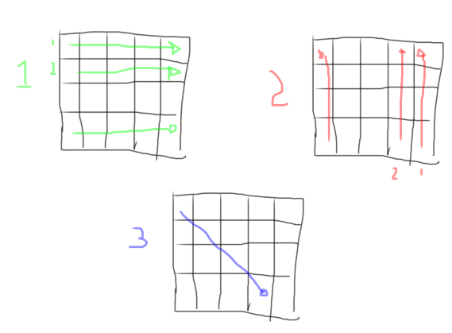

# Programa: P1E - Recorrido de matriz bidimensional
Realice el programa que dada una matriz de $n*m$, en donde el usuario introducirá el valor de n y m, siendo estos máximos 10, el arreglo es del tipo entero. Realice el siguiente recorrido:

 1. Recorrido por fila comenzando desde la casilla 00, siguiento 01, 02, 03 ... luego 10, 11... hasta $nm$.

 2. Recorrido por columnas comenzando desde $nm$, $n-1m$, $n-2m$, hasta 0m, para continuar con $nm-1$, $n-1m-1$, $n-2m$ ... $0m-1$ ..  el proceso deberá continuar hasta llegar a la casilla 00

 3. Realice el recorrido en diagonal desde la casilla 00, 11, 22, 33, siempre que $n=m$, considere el caso donde $n \ne m$, $n \lt m$ o $n \gt m$

 

## Características
- Enviar el programa a 900949@pcpuma.acatlan.unam.mx
- Enviar binario (.exe / .out dependiendo el caso)
- Enviar código fuente
